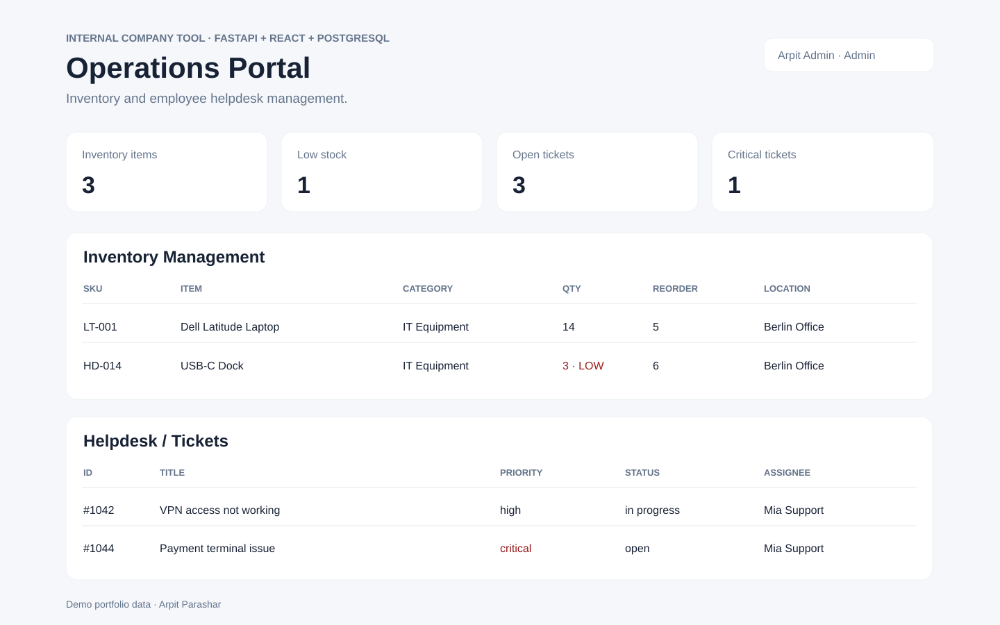

# Internal Operations Portal

A full-stack internal company tool combining **Inventory Management** and a **Helpdesk / Ticket Management System**.

## Why this project
This project demonstrates the same kinds of workflows commonly found in internal business applications: authenticated users, role-based permissions, CRUD operations, operational dashboards, stock control, support tickets, frontend/backend separation, REST APIs, database persistence, tests, Docker, and CI.



## Tech stack
- **Backend:** Python, FastAPI, SQLAlchemy
- **Frontend:** React, TypeScript, Vite
- **Database:** PostgreSQL (SQLite fallback for quick local development/tests)
- **Authentication:** JWT + bcrypt password hashing
- **DevOps:** Docker Compose, GitHub Actions
- **Testing:** Pytest

## Core features

### Authentication & users
- Register and log in users
- JWT bearer authentication
- Roles: `employee`, `support`, `manager`, `admin`
- Role-protected endpoints
- Managers/admins can view users

### Inventory Management
- Create, read, update and deactivate inventory items
- Unique SKU per item
- Track category, location, stock quantity and reorder level
- Stock-in / stock-out movements
- Prevent stock from dropping below zero
- Low-stock filter and dashboard KPI

### Helpdesk / Ticket Management
- Employees can create tickets
- Priority levels: low, medium, high, critical
- Status workflow: open, in progress, resolved, closed
- Support/manager/admin users can assign and update tickets
- Employees see only their own tickets; support roles can see the work queue
- Filter tickets by priority and status

## Architecture
```text
React + TypeScript frontend
          |
          | REST / JSON + JWT
          v
FastAPI application layer
          |
          | SQLAlchemy ORM
          v
PostgreSQL database
```

## API highlights
- `POST /auth/register`
- `POST /auth/login`
- `GET /users`
- `GET /inventory`
- `POST /inventory`
- `PATCH /inventory/{id}`
- `DELETE /inventory/{id}`
- `POST /inventory/{id}/movement`
- `POST /tickets`
- `GET /tickets`
- `PATCH /tickets/{id}`
- `GET /dashboard`

Interactive OpenAPI documentation is available at `/docs` when the backend is running.

## Run with Docker
```bash
docker compose up --build
```

- Frontend: http://localhost:5173
- Backend: http://localhost:8000
- API docs: http://localhost:8000/docs

## Run locally
### Backend
```bash
cd backend
python3 -m venv .venv
source .venv/bin/activate
pip install -r requirements.txt
python seed.py
uvicorn app.main:app --reload
```

Demo admin login after seeding:
- Email: `admin@example.com`
- Password: `password123`

### Frontend
```bash
cd frontend
npm install
npm run dev
```

## Tests
```bash
cd backend
pytest -q
```

## Business rules worth discussing in an interview
- Stock movements cannot reduce quantity below zero.
- Employees can only view their own tickets.
- Support/manager/admin roles can work the shared ticket queue.
- Only managers/admins can create or edit inventory master data.
- Only admins can deactivate inventory items.
- Low-stock status is derived from quantity compared with the reorder level.

## Good next improvements
- Alembic database migrations
- Refresh tokens and password-reset flow
- Audit log for ticket and inventory changes
- Pagination and full-text search
- File attachments on tickets
- Email/Slack notifications
- Datadog or OpenTelemetry monitoring
- Azure deployment with container registry + AKS

## Interview explanation
You can describe this as an internal operations tool built around two business workflows. The React frontend sends authenticated requests to FastAPI. FastAPI enforces user roles and business rules before writing changes through SQLAlchemy to PostgreSQL. GitHub Actions automatically runs backend tests and checks the frontend build after every push or pull request.

## Author
Arpit Parashar  
GitHub: https://github.com/ArpitParashar28  
LinkedIn: https://www.linkedin.com/in/arpit-parashar7777/
